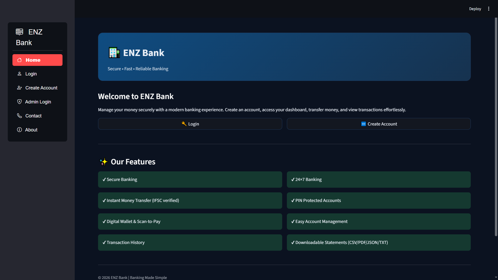
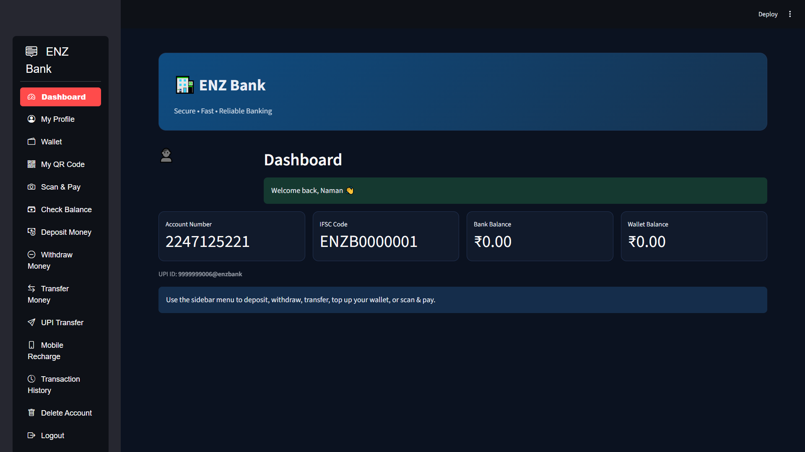
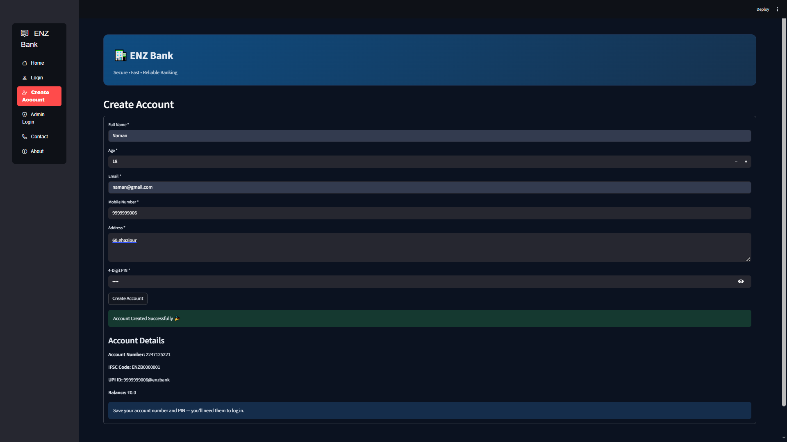
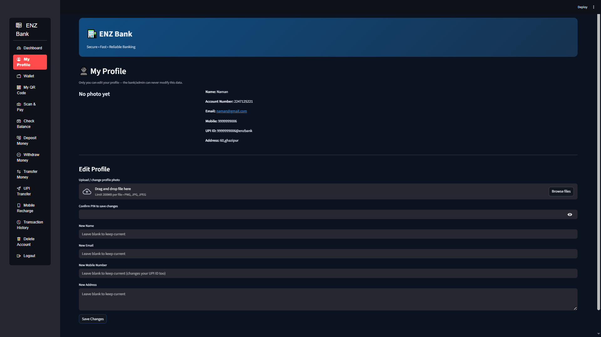
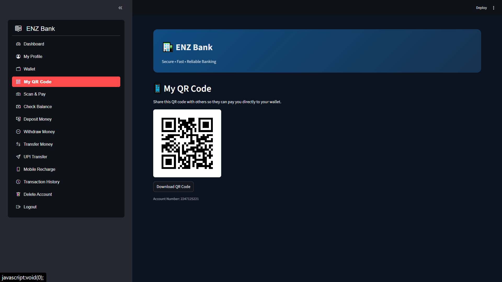
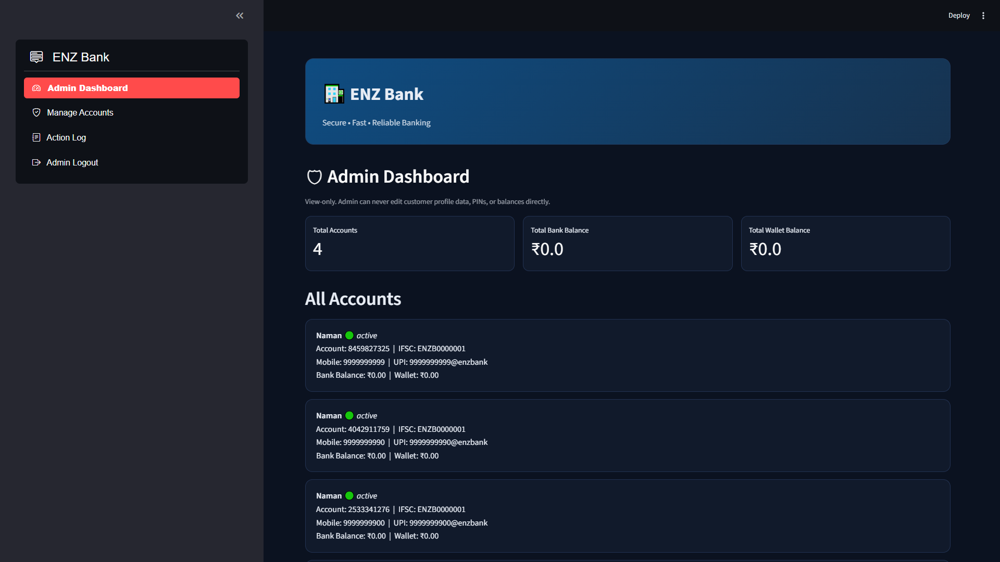
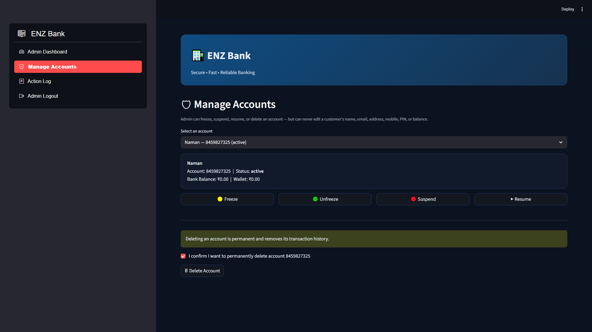
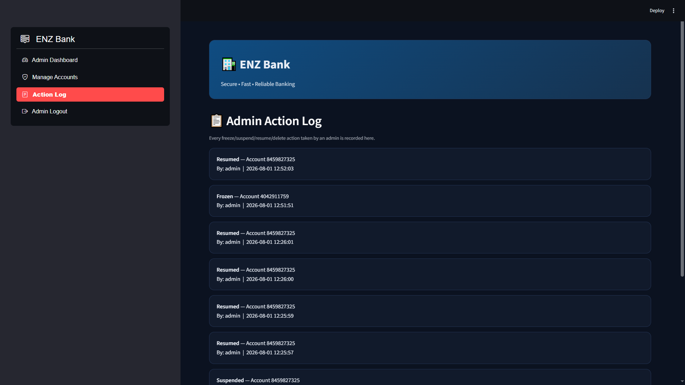

# 🏦 ENZ Bank

A modern Bank Management System built with Python, Streamlit and SQLite.

## Features

✅ Secure Login

✅ SQLite Database

✅ Deposit & Withdraw

✅ Money Transfer

✅ Wallet

✅ QR Scan & Pay

✅ UPI Transfer

✅ Transaction History

✅ PDF Statement Export

✅ Profile Management

✅ Admin Dashboard

## Tech Stack

Python

Streamlit

SQLite

ReportLab

QRCode

Pillow

## Installation

pip install -r requirements.txt

streamlit run app.py

## Screenshots

## Home

## Login Dashboard

## Create Account

## User Profile

## User QR

## Admin Dashboard

## Admin Account Management

## Admin Action

## Future Improvements

OTP Verification

Loan Module

Analytics Dashboard

Email Notifications

## Author

Tushar
